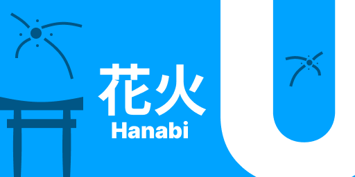

# Hanabi U (花火U) BETA

**El estado de este proyecto sigue siendo experimental. *esto todavía tiene bugs graves y no siempre funcionará***

Hanabi U sera un framework de codigo abierto para desarrollar applets para las consolas
Nintendo Wii U, en el cual podrás utilizar funcionalidades modernas de Javascript/Typescript.

Cosas para hacer
+ [ ] Utilizar las API's de WiiU
    + [ ] VINO
      + [ ] Polyfill para PC
    + [x] API de WiiU Browser
      + [x] Polyfill para PC
+ [x] Hacer polyfills
  + [x] Array.foreach/map/includes
  + [x] Fetch
  + [x] Promises 
+ [x] Funcionalidad base
  + [x] Componentes JSDOM
  + [x] Componentes JSX
  + [x] CSS Dinamico
+ [ ] Funcionalidades Especiales
  + [ ] Eventos del Servidor (Server Side Events)
  + [ ] WebSockets

Tecnologias usadas
+   Hono `hono/jsx` - Agradecemos a el equipo de Hono por desarrollar, esto no le pedi permiso pero gracias 😄
+   Typescript, for code transpilation

Soporte actual
+   **JSX**, crea interfaces estaticas usando HTML y Javascript
+   **DOM**, crea interfaces rápidas y dinamicas usando las herramientas que te otorga el DOM.